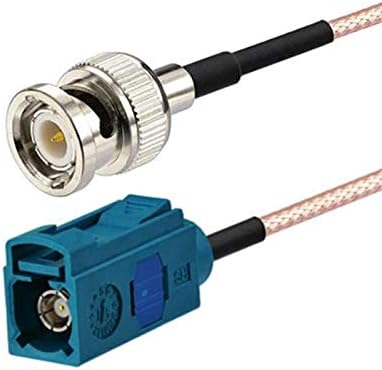

<h1 align="center"> FlatBackup </h1>

     <nbsp> <nbsp>
     <nbsp> <nbsp>
    

<h2 align="center"> Fisheye Image Correction and OBDII Boost Gauge </h2>

   {width=184px,height=64px}
{width=256px,height=64px}

 a
nmbxknx
### Overview

__NEEDS WORK__
Welcome to the Fisheye Image Correction and OBDII Data Visualization Project! This GitHub repository houses the collaborative efforts to develop a solution for enhancing the aftermarket OEM backup camera installation experience. Our goal is to take fisheye-distorted images from the backup camera, digitize the signal, and process it on a Raspberry Pi using Python and OpenCV. Additionally, we aim to display the corrected image on an HDMI screen while concurrently visualizing turbocharger boost pressure calculated from real-time data retrieved through the car's OBDII port.

### Project Components

#### > Raspberry Pi Implementation
Our solution runs on a Raspberry Pi, serving as the central hub for image correction and OBDII data processing. Python scripts handle the integration of these components, ensuring seamless operation.

### > Fisheye Image Correction
Utilizing the power of OpenCV and Python, we are implementing algorithms to correct fisheye-distorted images captured by aftermarket OEM backup cameras. This involves signal digitization and real-time processing on the Raspberry Pi.

### > OBDII Data Integration
The project integrates an ELM327 USB adapter with the car's OBDII port to continuously read data, specifically turbocharger boost pressure. This information is then processed and displayed alongside the corrected camera image.

$$ P \times V_{f} = m_{f} \times RT $$

The above equation is derived from the ideal gas law $ PV = nRT $ to relate the volumetric flow rate and molar mass flow rate of the intake air in order to calculate instantaneous boost pressure. All the necessary information is available through the OBDII connection to facilitate calculations as fast as the protocol can supply new data.

Since the Manifold Absolute Pressure (MAP) sensor readings are unavailable via the OBDII port I'm forced to rely on the next best thing, my car's Mass Air Flow (MAF) sensor. The sensor delivers readings of intake air flow in $g\over s$ and dividing this by the molar mass of air, given as $28.949$$g\over mol$ yields the flow rate of air molecules $m_{f}$.

The displacement of my car's engine is $1984cc$ which means half that volume of air flows through it with every rotation of the crankshaft. Dividing $1984cc\over2$ relates the volumetric flow to the (RPM) read from the car's OBDII connection. The Intake Air Temperature (IAT) sensor for the $T$ term and the value of the molar gas constant $R$ fill in the rest of the variables allowing for the calculation of instantaneous absolute pressure. 

Rather than assume a constant atmospheric pressure I instead subtract the car's barometric pressure sensor (BPS) readings from the calculated absolute pressure to determine actual boost after some unit conversions to make all the equation terms play nicely together, trading time for accuracy. If the result is negative that means the system is in vacuum and the reading is converted from $PSI$ to $bar$ since I don't really care as much about the magnitude. All of this is handled by the aptly named Unit python library.

### > Wiring and Mounting

Signals broken out to the standard OBDII port protocol from the ECU:
1. Manifold Absolute Pressure (X)
1. RPM
1. IAT
1. MAF
1. Baro pres

## Project Implementation

This project started with my search for the best backup camera to retrofit onto my 2013 Audi A3. With no visually appealing universal solutions on the market I made several attempts to fashion my own low-profile solution with replacements for the stock license plate light fixture as well as the latch module for opening the rear hatch, but none of the solutions worked quite the way I was hoping for. More importantly they lacked the seamless integration of an OEM component.

Owing to my experience with repairing and maintaining my cars I was aware that many parts are shared across multiple vehicles in a conglomerate like VW's lineup and while the 8P generation of the A3 wasn't offered with an option for a backup camera a quick parts site search revealed that the same trunk latch on my car was also used in the A6 an Q7 from that era. Luckily both did have a backup camera option and a quick jaunt to eBay yielded a listing of the component with a camera installed for around $100 USD. The seller was even kind enough to cut the wires upstream of the power and video connections which made soldering the power wires extremely convenient. 

The video connection is facilitated by a proprietary RF connector called Fakra, and after scouring a number of forums and other google results I figured out which of the many different key options for that series it was based on the color. Only after a fruitless search for a key-specific adapter did I learn that a universal "Z" key Fakra variation exists that works with most of the key options, including the one from my camera. Most reputable suppliers offered adapters to BNC and RCA and all were outrageously expensive however [Amazon came to the rescue](https://a.co/d/6lxqHxw) with a cheap chinese mass-produced solution. It is no longer offered but I'm sure there are plenty of similar offerings available now. I probably should have bought 2 but only time will tell.

Wiring involved removing the interior trim of the rear hatch and running wires along the existing harnesses, although I wasn't able to get the wires through the weatherproof articulated tube in which the stock harnesses are run and I ended up taking out more inner body panels off than I should have. Getting everything back together necessitated pulling all the rest of the trim panels from the trunk before reinstalling everything properly. If I were to go back and do it again I would try to vacuum a string through that tube to pull the wires with. The Fakra system is essentially an easily removable shell around an SMB connector, which is a small RF connector similar to BNC or SMA but with no retention features. As it is a small loop of wires exits the top of the hatch with enough slack to reach the headliner trim while the hatch is fully open. It is visible but unobtrusive and proper cable management helps keep it from moving much while driving.

I connected the 12V power supply in line with harness wires for the trunk 12V accesory plug using some high current waterproof connectors I had on hand keeping nearly the entire wire run out of the cabin. A second small loop of the power cable was routed through a vent in the trunk trim with a redundant set of connectors as a failsafe quick disconnect. With the trim removed I also took the oppotunity to wire up some high power Philips LEDs on custom-made aluminum PCBs to replace the pathetically dim single incandescent bulb that used to illuminate my trunk. Even at night it's always bright and sunny in there now!

The output from my newly installed camera was initially displayed on a cheap flip up display from Amazon or eBay or wherever. It was somehow always too dim in the daytime and too bright at night and had an annoying habit of sliding around despite the thoughtful inclusion of a small square bit of drawer liner included for use on the dashboard so I knew I would have to find a better long-term solution. With the distortion from the wide angle lens not much useful detail could be made out on the standard 4:3 ratio screen size with massive portions of the screen wasted displaying the camera's view of my license plate and the edge of the trunk sheet metal in which it is mounted. An idea was forming...

Screen acquisition, touch integration

I had recently purchased this lovely aftermarket phone adapter that conveniently mounts between the two high-mounted center vents of my dashboard that would serve as the perfect base for mounting my homebrew solution. After removing the simple magnetic holder it came with I installed an articulated Scosche handsfree wireless charging mount, securing a length of scrap aluminum angle extrusion to the other side with the ball joint retaining screw. With a small angle bracket and some fastening hardware I mounted a second length of extrusion with holes drilled out to match the mounting pattern of my new widescreen display. It's practical but I'd like to replace it with something a bit more attractive down the line. Something in the vein of the beautiful custom devices build by (youtube guy with submerged computer cooling, custom tablet build)

threading, 3 vs 4

## Future Development Goals

1. convert code to C++
1. implement backup battery with smart charging and custom BMS
1. ML object detection support to minimize power and storage use in sentry mode
1. Bluetooth audio endpoint with autoconnect
1. Apple CarPlay
1. Pi 5, nvme drive

## Contribution Guidelines

This project is wildly application specific but I welcome any feedback or suggestions you might have! If you were inspired to build your own similar system or would like some guidance to replicate this specific solution I would love hear from you as well!

Flatten wide angle image from OEM Audi backup camera with python3, OpenCV, and Raspberry Pi
Hardware includes EasyCap knockoff capture device, an 8" 1600x480px screen with mounting
for the pi built in, and a heatsink with fan to keep things cool. A Meanwell DC/DC converter
steps the car voltage down to 5V