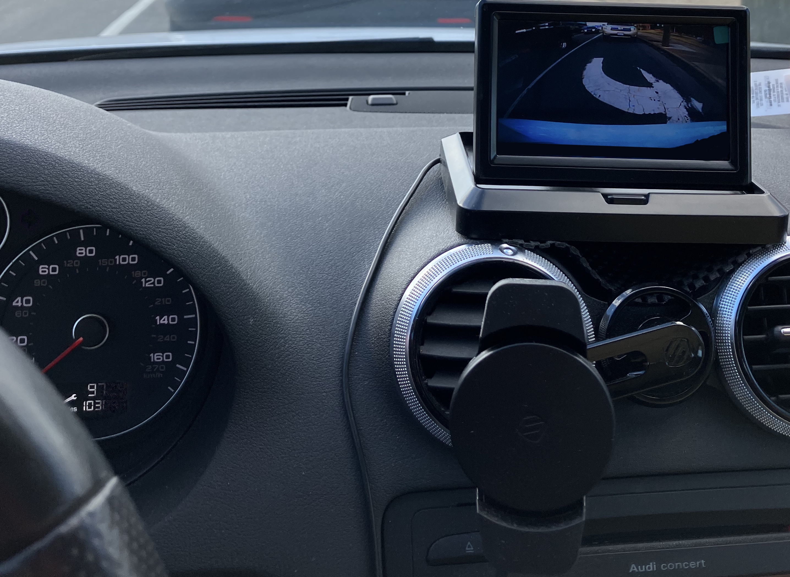
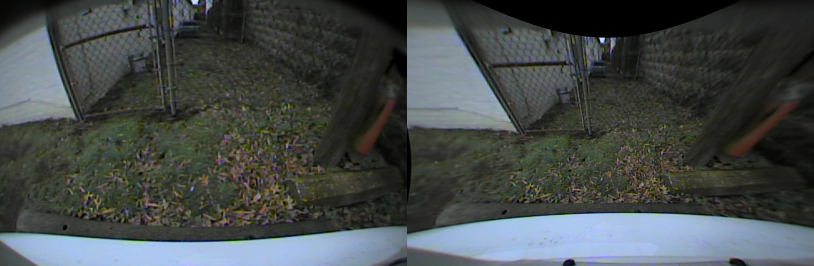
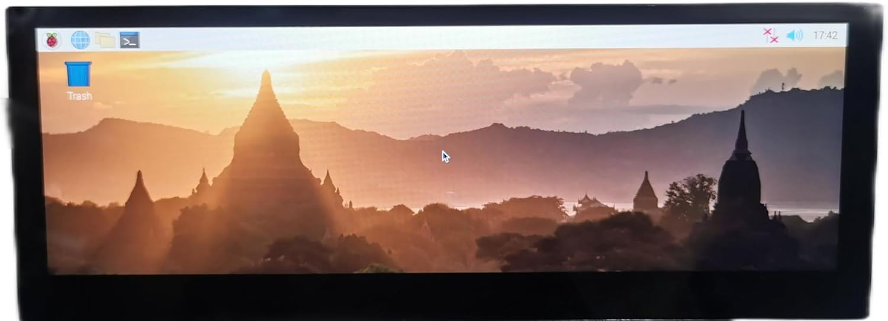
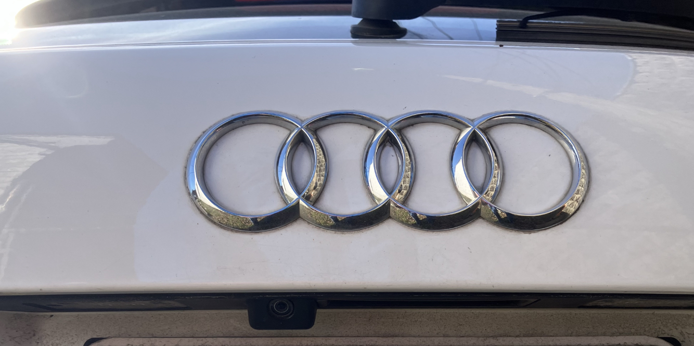
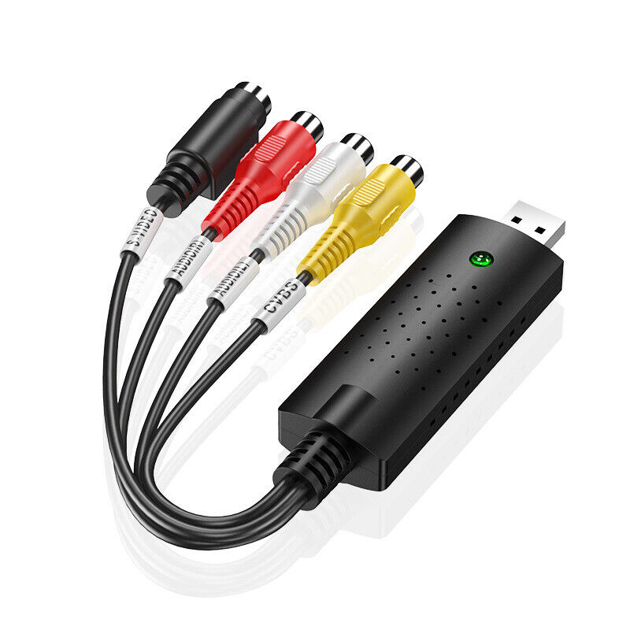
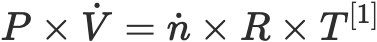

<h1 align="center"> FlatBackup </h1>

     <nbsp> <nbsp>
     <nbsp> <nbsp>
    

<h2 align="center"> Fisheye Image Correction and  OBDII Boost Gauge  </h2>

    

## Overview
What started as a simple effort to upgrade my 2013 Audi A3 with a backup camera and a cheapo flip-up screen quickly spiraled into a deep rabbit hole involving vision processing, creative use of non-standard OEM equipment, and an off the cuff design choice to visualize performance data. While this repository is written in an instructional format I can't stress enough that I do not recommend anybody try to replicate it. Hopefully it can be educational for someone, I know I learned a whole lot along the way. After the original screen went flying off the dash on numerous occcaisions then mysteriously failed for unrelated reasons and in an effort towards upgrading my car's ergonomics I retrofitted a [Scoshe wireless charger](https://www.amazon.com/MCQVP-XTET-MagicMount-Magnetic-Qi-Certified-FreeFlow/dp/B07Z7CYRD2?th=1) along with a backup screen to this [Clearmounts dashboard bracket](https://www.audiphoneholder.com/product/78/clearmounts-bracket-low-profile-magnetic-holder-part-8p-low) to hold me over. My engineered solutiong for mounting the cheaper, smaller replacement screen would have certainly benefitted from the liberal application of duct tape and I knew I could do better. Through happenstance and too much time spent on the Amazon app I've cobbled together a satisfactory driving augmentation interface by combining a previously modified dashboard phone mount, an A/V digitizer, an OBD to serial converter, a Meanwell DIN-rail mounted 5V power supply, a webcam, a flash drive, and a wide aspect ratio touchscreen with mounting hardware for a Raspberry Pi to undistort the fisheye video from my OEM backup camera with the power of OpenCV. After some interior modifications to hide wiring and install a switch that took much longer than anticipated I think the whole project came together quite nicely.

##### Some of the topics I had to familiarize myself with throughout the course of this project, in no particular order:
1. C++
1. OpenCV
1. Python built-in libraries
1. Inheritence and project organization
1. Automation using `systemd` services
1. Linux graphics processing

## Project Components

#### > Touchscreen and Raspberry Pi

My solution runs on a Raspberry Pi, serving as the central hub for image correction and OBDII data processing. Python scripts handle the integration of these components with multi-threaded processing to promote seamless operation. In order to maximize the useable regions of the undistorted image this project required an extra wide screen and luckily I found a screen on amazon that provided the optimal aspect ratio and even integrated support for mounting the Pi directly to it. This exact screen is no longer available but [this unit from amazon](https://www.amazon.com/dp/B087CNJYB4/ref=sspa_dk_detail_0) is nearly identical and there are [many](https://www.amazon.com/ElecLab-Touchscreen-Capacitive-1280x480-10-3-inch-hdmi-1280x480/dp/B0BWSSKDV4/ref=sr_1_2) [other](https://www.amazon.com/gp/product/B09SVDCSQJ/ref=ox_sc_act_title_2) [options](https://www.amazon.com/ElecLab-Raspberry-Touchscreen-Capacitive-1280x400/dp/B09YJ37SBH/ref=sr_1_3) to choose from depending on your application. Touch input was the last piece of the puzzle, and after a failed attempt to implement it in pure python using the `async` library I instead opted to pipe the output of the shell command `evtest` through the `Popen` construct of the `Subprocess` python module to a queue that is handled in the main thread.

#### > OEM Camera Fisheye Image Correction

Utilizing the power of OpenCV and Python, I've implemented built-in undistortion algorithms to correct fisheye lens-distorted images captured with the replacement OEM backup camera. A [clone of the EasyCap USB A/V digitizer](https://www.ebay.com/itm/383709416325) facilitates analog video conversion enabling real-time processing on the Raspberry Pi for display in a more natural perspective.
`threading`, `queue`s, and `c++` oh my
__FIXME__
Between the regular undistortion method and the fisheye submodule verison, the latter seemed to suit my backup camera lens better with testing. Through some trial and error with a small helper script crafted to generate a set of baseline calibration images, a fairly consistent and replicable list of numbers was produced by the module's undistortion method. This list is used to create a matrix for reconstructing the raw image in a flattened perspective. The calibration script became more complicated yet more precise as additional tutorials and documentation for the fisheye submodule of OpenCV were reviewed.

    
    

#### > OBDII Data Integration

An extraordinarily wide screen proved to be the most practical way to display the useful viewing area of the undistorted image however after tweaking the final layout some unused space remained to one side. I decided to use this space for displaying the boost pressure from the car's turbocharger. There are a number of ways to measure boost pressure in a forced induction car though most of them require invasive modifications that can compromise the weatherproofing of the interior. Rather than adding an air hose for a mechanical guage or running a wire through the heat shield to the engine bay I opted to use the built in sensors from the factory. The output of these sensors can be accessed through the OBDII port with an ELM327 USB adapter thanks to some handy code from [brendan-w](https://github.com/brendan-w/) with this [python-OBD project](https://github.com/brendan-w/python-OBD/).

My car comes with a Manifold Absolute Pressure (MAP) sensor but Audi in their infinite wisdom decided not to break out values from reading that particular sensor via the standard OBD protocol. Not to worry; using only the total engine displacement volume, the RPM, readings from the Intake Air Temperature (IAT) sensor, and readings from the Mass Air Flow (MAF) sensor combined with some fancy high school math the boost pressure can be calculated within a reasonable margin of error:

    

$$ P \times V̇ = ṅ \times R \times T^{[1]} $$

The above equation is derived from the ideal gas law $PV = nRT$ to relate the volumetric flow rate and molar mass flow rate of the intake air in order to calculate instantaneous boost pressure. All the necessary information is available through the OBDII connection to facilitate calculations as fast as the protocol can supply new data. Breaking down the terms:

1. $P$ is the instantaneous boost pressure we are calculating
1. $V̇$ is the volumetric flow rate of gas through the engine or 1984$cc$ for every two rotations of the crankshaft
1. $ṅ$ is the molar flow rate of air determined by dividing the MAF sensor output ($ṁ$) in $g \over s$ by the molar mass of air, 28.949 $g\over mol$
1. $R$ is the gas constant, helpfully provided by the `Unit` python library
1. $T$ is the absolute temperature read from the IAT sensor and converted to Kelvin

Rather than assume a constant atmospheric pressure the car's barometric pressure sensor (BPS) readings are subtracted from calculated absolute pressure to determine true boost pressure. If the result is negative that means the system is in vacuum and the reading is converted from $PSI$ to $bar$ since I don't really care as much about the magnitude. All of this is handled by the aptly named `Unit` python library.

This document provides an introductory overview of the project. A more comprehensive description of the setup and development steps can be found [here](./SETUP.md) 

## Future Development Goals

1. Asynchronous execution!
1. Smoothing upscale with ML using coral TPU
1. Pi 5, nvme drive for cable cleanup and easy access
1. Custom PCB to consolidate power, digitization, OBD connection, and wiring
1. Implement backup battery with smart charging and fail-safe BMS
1. ML object detection support to minimize power and storage use in sentry mode

## Contribution Guidelines

This project is wildly application specific but I welcome any feedback or suggestions you might have! If you were inspired to build your own similar system I would love hear from you as well!

Image source: https://wall.alphacoders.com/big.php?i=474466

