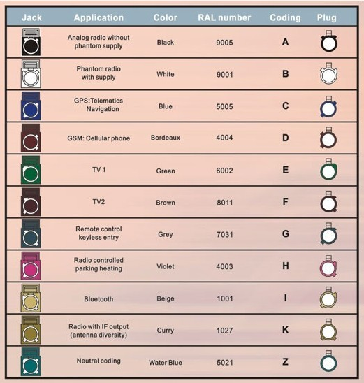
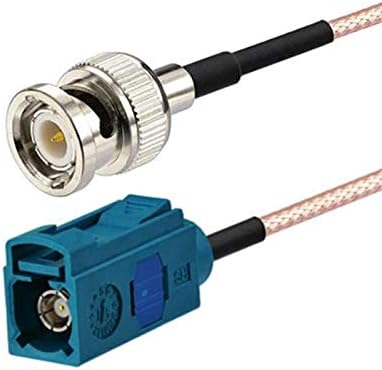
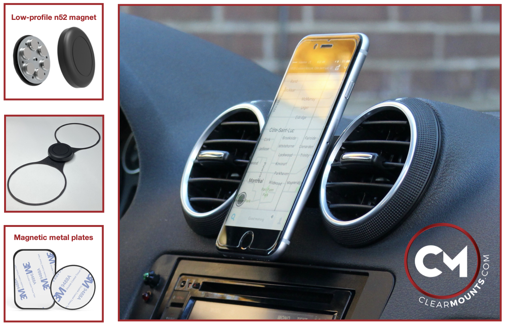

<h1 align="center"> FlatBackup </h1>

     <nbsp> <nbsp>
     <nbsp> <nbsp>
    

<h2 align="center"> Fisheye Image Correction and  OBDII Boost Gauge  </h2>

### Overview
Welcome to my fisheye backup camera image correction and automotive data processing project! This GitHub repository contains the code underlying my efforts to develop a solution for enhancing my custom car backup camera installation. The project evolved from a desire to cut my teeth with a powerful tool I had only had peripheral experience with both academically and professionally, OpenCV. When I installed an Audi original backup camera into my car, the image projected to a standard 4:3 ratio NTSC resolution screen was heavily distorted from the fisheye lens and I knew that was something I could rectify using the power of Python and OpenCV. With a knock-off Easy-Cap adapter to digitize the signal I am able to process the video stream on a Raspberry Pi and display the corrected image on an HDMI screen. An ELM327 USB OBDII adapter allows me to calculate and display turbocharger boost pressure from real-time car sensor data.

## Background
Opportunity to learn 
1. C++
1. OpenCV
1. python builtin libraries
1. explore inheritence and project organization

As much as I'd like to say I've done something groundbreaking with this project, after many hours of head-banging and frustration, testing, construction, basically everything I've done could be replicated with some custom code running on an android tablet and an off-the-shelf windshield mount. That being said I was able to use the experience to try out OpenCV and C++ for the first time and I learned a whole lot, mainly that I have much more to learn. This project started with my search for the best backup camera to retrofit onto my last-generation Audi A3. With no visually appealing universal options on the market several attempts were made to fashion custom low-profile solutions. Aftermarket replacements for the stock license plate light fixture as well as the latch actuator module for opening the rear hatch failed to live up to expectaions. More importantly they lacked the seamless integration of an OEM component. I was pretty sure that 8P A3 wasn't offered with a backup camera but I didn't give up hope for a factory solution. The rear latch for the A3 is also used on the A6 and Q7, both of which had alternatives that came with a backup camera. After perusing eBay I found a used part that included the camera with both power and signal plug sets intact.

The output from my newly installed camera was initially displayed on a cheap flip up display from Amazon or eBay or wherever. It was somehow always too dim in the daytime and too bright at night and had an annoying habit of sliding around despite the thoughtful inclusion of a small square bit of drawer liner for use on the dashboard. I knew I would have to find a better long-term solution. With the distortion from the wide angle lens not much useful detail could be made out on the standard 4:3 ratio screen size and displaying the camera's view of my own license plate seems like kind of a waste of resources. Having already retrofitted my [Scoshe wireless charger](https://www.amazon.com/MCQVP-XTET-MagicMount-Magnetic-Qi-Certified-FreeFlow/dp/B07Z7CYRD2?th=1) and a more stable screen to my [Clearmounts dashboard bracket](https://www.audiphoneholder.com/product/78/clearmounts-bracket-low-profile-magnetic-holder-part-8p-low), an idea began to take shape...

### Project Components

__link to setup__ [Setup](./SETUP.md)
#### > Touchscreen and Raspberry Pi
My solution runs on a Raspberry Pi, serving as the central hub for image correction and OBDII data processing. Python scripts handle the integration of these components with multi-threaded processing to promote seamless operation. In order to maximize the useable regions of the undistorted image this project required an extra wide screen and luckily I found a screen on amazon that provided the optimal aspect ratio and even integrated support for mounting the pi directly to it. This exact screen is no longer available but [this unit from amazon](https://www.amazon.com/dp/B087CNJYB4/ref=sspa_dk_detail_0) is nearly identical and there are [many](https://www.amazon.com/ElecLab-Touchscreen-Capacitive-1280x480-10-3-inch-hdmi-1280x480/dp/B0BWSSKDV4/ref=sr_1_2) [other](https://www.amazon.com/gp/product/B09SVDCSQJ/ref=ox_sc_act_title_2) [options](https://www.amazon.com/ElecLab-Raspberry-Touchscreen-Capacitive-1280x400/dp/B09YJ37SBH/ref=sr_1_3) to choose from depending on your application. Touch input was the last piece of the puzzle, and after a failed attempt to implement it in pure python using the `async` library I instead opted to pipe the output of the shell command `evtest` through the `Popen` construct of the `Subprocess` python module to a queue that is handled in the main thread.

#### > OEM Camera Fisheye Image Correction
Utilizing the power of OpenCV and Python, I've implemented built-in undistortion algorithms to correct fisheye lens-distorted images captured with the replacement OEM backup camera. 
__MORE PROCESS__
A [clone of the EasyCap USB A/V digitizer](https://www.ebay.com/itm/383709416325) facilitates analog video conversion enabling real-time processing on the Raspberry Pi for display in a more natural perspective. Between the regular undistortion method and the fisheye submodule verison, the latter seemed to suit my backup camera lens better with testing. Through some trial and error with a small helper script crafted to generate a set of baseline calibration images, a fairly consistent and replicable list of numbers was produced by the module's undistortion method. This list is used to create a matrix for reconstructing the raw image in a flattened perspective. The calibration script became more complicated yet more precise as additional tutorials and documentation for the fisheye submodule of OpenCV were reviewed.
__threading, 3 vs 4,__

#### > OBDII Data Integration
An extraordinarily wide screen proved to be the most practical way to display the useful viewing area of the undistorted image however after tweaking the final layout some unused space remained to one side. I decided to use this space for displaying the boost pressure from the car's turbocharger. There are a number of ways to measure boost pressure in a forced induction car though most of them require invasive modifications that can compromise the weatherproofing of the interior. Rather than adding an air hose for a mechanical guage or running a wire through the heat shield to the engine bay I opted to use the built in sensors from the factory. The output of these sensors can be accessed through the OBDII port with an ELM327 USB adapter thanks to some handy code from [brendan-w](https://github.com/brendan-w/) with this [python-OBD project](https://github.com/brendan-w/python-OBD/).

My car comes with a Manifold Absolute Pressure (MAP) sensor but Audi in their infinite wisdom decided not to break out values from reading that particular sensor via the standard OBD protocol. Not to worry; using only the total engine displacement volume of 1984$cc$, the RPM, readings from the Intake Air Temperature (IAT) sensor, and readings from the Mass Air Flow (MAF) sensor combined with some fancy high school math the boost pressure can be calculated within a reasonable margin of error:

$$ P \times V_{f} = m_{f} \times RT^{[1]} $$

The above equation is derived from the ideal gas law $ PV = nRT $ to relate the volumetric flow rate and molar mass flow rate of the intake air in order to calculate instantaneous boost pressure. All the necessary information is available through the OBDII connection to facilitate calculations as fast as the protocol can supply new data. Breaking down the terms:

1. $P$ is the instantaneous boost pressure we are calculating
1. $V_{f}$ is the volumetric flow rate of gas through the engine or 1984$cc$ for every two rotations of the crankshaft
1. $m_{f}$ is the molar flow rate of air determined by dividing the MAF sensor output in $g \over s$ by the molar mass of air, 28.949$g\over mol$
1. $R$ is the gas constant, helpfully provided by the Unit python library
1. $T$ is the absolute temperature read from the IAT and converted to Kelvin

Rather than assume a constant atmospheric pressure the car's barometric pressure sensor (BPS) readings are subtracted from calculated absolute pressure to determine true boost pressure. If the result is negative that means the system is in vacuum and the reading is converted from $PSI$ to $bar$ since I don't really care as much about the magnitude. All of this is handled by the aptly named `Unit` python library.

#### > Wiring and Mounting

Video is carried through a Fakra antenna connector which come with many different key options. This is typically indicated by the housing color according to the internet and I spent much too long on a fruitless search for a high quality adapter specific to the key of the plug for the camera. A plethora of cheap options were forthcoming but the quality of the plug housings on most leave a lot to be desired and I don't look forward to repeating the interior trim disassembly to replace a broken plug. With a deeper dive through my references I realized that a universal "Z" key Fakra variation exists which works with most of the key options including our camera plug. High quality RF cables with custom terminations are typically expensive from reputable suppliers but [Amazon came to the rescue](https://a.co/d/6lxqHxw) with a mass-produced solution. The one from the link is no longer offered but I'm sure there are plenty of similar products available now. I used a small BNC to RCA adapter and slim RCA cable from [monoprice](https://www.monoprice.com/product?p_id=4127) although they no longer appear to offer the latter.

 

 __a heatsink with fan to keep things cool. A Meanwell DC/DC converter steps the car voltage down to 5V__

__FIXME__
Wiring involved removing the interior trim of the rear hatch and running wires along the existing harnesses. There exists a channel for routing the factory harness from the roof through a hose protecting them from the elements. The hose was too tight to push a stiff wire through so the power and video cables run out of the trim and through the cabin in a way that is noticeable but unobtrusive. 
 although I wasn't able to get the wires through the weatherproof articulated tube in which the stock harnesses are run and I ended up taking out more inner body panels off than I should have. Getting everything back together necessitated pulling all the rest of the trim panels from the trunk before reinstalling everything properly. If I were to go back and do it again I would try to vacuum a string through the existing wire tube to pull my cables with. The Fakra system is essentially an easily removable shell around an SMB connector, which is a small RF connector similar to BNC or SMA but with no retention features.

 As it is a small loop of wires exits the top of the hatch with enough slack to reach the headliner trim while the hatch is fully open. It is visible but unobtrusive and proper cable management helps keep it from moving much while driving.
__picture of progress, picture of final wire arrangement__

I connected the 12V power supply in-line with harness wires for the trunk 12V accesory plug using some high current waterproof connectors I had on hand keeping nearly the entire wire run out of the cabin. I left a small loop with a pair of connectors running through some vent slots in the side panel as a quick disconnect in case any work needs to be done with the wiring down the line. With the trim removed I also took the oppotunity to wire up some high power Philips LEDs on custom-made aluminum PCBs to replace the pathetically dim single incandescent bulb that used to illuminate my trunk. As you might imagine from the below image, I don't think I'll have much trouble finding anything back there ever again.

A recently purchased [Clearmounts phone adapter](https://www.audiphoneholder.com/product/78/clearmounts-bracket-low-profile-magnetic-holder-part-8p-low), pictured below, serves to conveniently and robustly secure my homebrew solution between the two centermost vents on my dashboard. After removing the simple magnetic holder that came with it I installed an articulated Scosche handsfree wireless charging mount similar to one that previously mounted to my windshield with a suction cup. I realized this model would be unsuitable for adapting to my project only after disassembling it completely so I purchased the articulated vent-mount model, securing a length of scrap aluminum angle extrusion to the back with the ball joint retaining screw through the Clearmounts adapter. Using a small L-bracket and some fastening hardware I mounted a second length of extrusion with holes drilled out to match the mounting pattern of my new widescreen display. It's practical but I'd like to replace it with something a bit more attractive down the line, perhaps in the vein of the beautiful custom devices built by [DIY Perks on YouTube](https://www.youtube.com/c/diyperks).

## Future Development Goals

1. Async execution!
1. Implement backup battery with smart charging and custom BMS
1. Smoothing upscale with ML using coral TPU
1. ML object detection support to minimize power and storage use in sentry mode
1. Bluetooth audio endpoint autoconnect
1. Apple CarPlay
1. Pi 5, nvme drive

## Contribution Guidelines

This project is wildly application specific but I welcome any feedback or suggestions you might have! If you were inspired to build your own similar system or would like some guidance to replicate this specific solution I would love hear from you as well!

Image source: https://wall.alphacoders.com/big.php?i=474466

